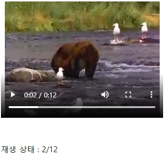
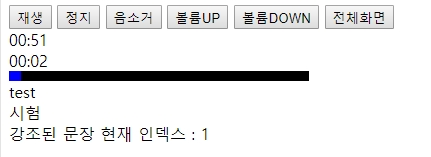

# Table of Contents

* 퍼블리싱가이드(2020.03.02~) [【→】](https://github.com/netfolder/netfolder.github.io/tree/master/p_guide)
* css[【↓】](#css)
	- sass문법[(보기)](https://github.com/netfolder/netfolder.github.io/tree/master/sass) ing..
	- 일부 글꼴 크기가 Safari (iPhone)에서 더 크게 렌더링 이슈 해결법[【→】](https://demun.tistory.com/2402)
* px to vw calc[【→】](https://pxtovw.dev-calc.space/)
* px to vw_calc page[【→】](https://netfolder.github.io/vw_calc.html)
* web font 참고문서[【→】](https://wit.nts-corp.com/2017/02/13/4258)
* comment[【↓】](#comment)
* rollingPlugin[【↓】](#sample)
* fixedNavigation(반응형 대응)[【↓】](#fixedNavigation)
* image 사용법[【↓】](#image)
* youtobe 이것저것[【↓】](#youtobe)
* video tag[【↓】](#video)
* video 진행중인 현재 시간대의 데이터 체크 하여 자막 활성[【↓】](#video2)
* radio btn custom [【↓】](#radio)
* checkbox btn custom [【↓】](#checkbox)
* css3 effect flip [【↓】](#flip)
* 소스창고
	- drag float menu[(보기)](https://netfolder.github.io/drag/sample.html)

-----


<a name='css'></a>
## CSS
- reset.css[(보기)](https://github.com/netfolder/study/blob/master/menu_content/submenu/css/default.css)
- Airbnb CSS / Sass Styleguide 방법론[(보기)](https://github.com/airbnb/css#oocss-and-bem)
- [IR기법(Image Replacement)](https://nuli.navercorp.com/sharing/blog/post/1132804) : 대체 텍스트 제공
``` css
/* 의미있는 이미지의 대체 텍스트를 제공하는 경우(Phark Method) */
.ir_pm {display:block; overflow:hidden; font-size:0; line-height:0; text-indent:-9999px;}
/* 의미있는 이미지의 대체 텍스트로 이미지가 없어도 대체 텍스트를 보여주고자 할 때(WA IR) */
.ir_wa {display:block; overflow:hidden; position:relative; z-index:-1; width:100%; height: 100%;}
/* 대체 텍스트가 아닌 접근성을 위한 숨김 텍스트를 제공할 때 */
.ir_su {overflow: hidden; position:absolute; width:0; height:0; line-height:0; text-indent:-9999px;}
```
- CSS3 calc
``` css
height : 100%; /* 구식 브라우저를 위한 대비책(fallback) */
height : -webkit-calc(100% - 1px); /* for Chrome, Safari */
height :    -moz-calc(100% - 1px); /* for Firefox */
height :         calc(100% - 1px); /* for IE */
```


-----
<div style="text-align: right"> <a href="#top">⬆ back to top</a> </div>

<a name='image'></a>
## Image

| 종류 | PC web | Mobile Web |
| :-------- | :-------- | :-------- |
| GIF | 기본 | 사용 가능 |
| JPG | 컬러수 많거나 운영성 이미지일 때 | 운영성 이미지일 때 |
| PNG-8 | x | 기본 |
| PNG-24 | 반투명효과가 있을 때에만 사용 | 컬러 수 많거나 반투명효과가 있을 때 |
| 이미지 스프라이트 | 	O | 	O |

* PC Web
	* 기본 포맷은 GIF를 사용한다.
	* JPG는 인물이나 실사 이미지와 같이, 색 변화 및 그라데이션이 풍부한 경우 및 운영성 이미지에 주로 사용한다.
	* JPG로 저장 시 압축률 관리
		* Save for web 기준 : Original 혹은 JPG Quality 90 이상
	* 구형브라우저에서의 PNG 이미지 지원</br>
* Mobile Web
	* 3G망을 이용하는 유저를 고려하여 용량 축소가 중요하다.
	* PNG-8 포맷을 기본으로 저장하며, 색상 수가 많거나 반투명 효과가 있으면 PNG-24를 사용한다.
	* 용량 대비 이미지 품질을 고려하여 포맷을 변경할 수도 있다.


-----
<div style="text-align: right"> <a href="#top">⬆ back to top</a> </div>

<a name='sample'></a>
## rollingPlugin

- swiper 3.x[(소스보기)](https://netfolder.github.io/swiper)
> [(공식 git 방문)](https://github.com/nolimits4web/swiper)
> [(3.x api)](http://g-mops.net/epica_swiper/api/index.html)

- bxSlider[(소스보기)](https://netfolder.github.io/bxSlider/)
> [(공식 git 방문)](https://github.com/stevenwanderski/bxslider-4)

- slick[(소스보기)](https://netfolder.github.io/slick)
> [(공식 git 방문)](https://github.com/kenwheeler/slick)


-----
<div style="text-align: right"> <a href="#top">⬆ back to top</a> </div>


<a name='fixedNavigation'></a>
## fixedNavigation ( responsive )

- fixedNavigation[(소스보기)](https://netfolder.github.io/samplePage/)


-----
<div style="text-align: right"> <a href="#top">⬆ back to top</a> </div>


<a name='youtobe'></a>
## youtobe[(api)](https://developers.google.com/youtube/player_parameters#controls)

``` html
//반복재생
http://www.youtube.com/v/VIDEO_ID?version=3&loop=1&playlist=VIDEO_ID
```

-----

<div style="text-align: right"> <a href="#top">⬆ back to top</a> </div>


<a name='video'></a>
## video[(codepen)](https://codepen.io/alikerock/pen/LNRGde)[(샘플보기)](https://netfolder.github.io/video/video.html)



``` html
//초기값
<video id="vod_obj" width="100%" height="240" controls="" style="margin-bottom: 50px;">
	<source src="https://s3-us-west-2.amazonaws.com/s.cdpn.io/485050/movie.mp4" type="video/mp4">
	<source src="https://s3-us-west-2.amazonaws.com/s.cdpn.io/485050/movie.ogg" type="video/ogg">
	Your browser does not support the video tag.
</video>
<div id="playtime"></div>
<script>    
	var vod_control = document.getElementById("vod_obj");
	vod_control.addEventListener("ended", event, false);
	function event(){
		console.log("미디어 재생이 완료되었습니다")
	}


	vod_control.addEventListener("timeupdate",playTime,false);
	function playTime(){
		document.getElementById("playtime").innerHTML =
		"재생 상태 : " + Math.floor(vod_control.currentTime) + "/" + Math.floor(vod_control.duration);
	}
</script>
```

-----
<div style="text-align: right"> <a href="#top">⬆ back to top</a> </div>


<a name='video2'></a>
## video2[(샘플보기)](https://netfolder.github.io/video/video_txt.html)



``` html
//초기값
<audio id="video" width="320" height="">
	<source src="src/read_fun_all.mp3" type="audio/mp3">
</audio>
```

```javascript
var time_set = [
	...
	[],
	[
		1.000, 3.433,
		"test",
		"시험",
	],
	[
		5.000, 7.433,
		"Open the door, please.",
		"문을 열어 주세요.",
	]
	...
]
	
//진행시간대의 데이터를 체크해주는 부분
var test_time = current.toFixed(3);
var sum = time_set.reduce(function (pre, value , currentIndex , currentValue) {
	console.log("=====>"  ,  (value[0] < test_time) && (test_time < value[1]) ) ;
	if((value[0] < test_time) && (test_time < value[1]) ){
		console.log(currentValue[currentIndex][2])
		console.log(currentValue[currentIndex][3])
		$(".txt_sample").html(currentValue[currentIndex][2] + "<br>" + currentValue[currentIndex][3]+ "<br> 강조된 문장 현재 인덱스 : " + currentIndex)
	
	}else if( (value[0] < test_time) && (test_time < value[1]) == false){
			$(".txt_sample").html("자막이 없는 구간 !!!")

	}
});
```

-----
<div style="text-align: right"> <a href="#top">⬆ back to top</a> </div>


<a name='radio'></a>
## radio btn custom[(go)](https://netfolder.github.io/radio/radio.html)

``` css
 p{position: relative;}
.circle{background-color: #fff;width: 36px; height: 36px; border:2px solid #01b4f8; color: #01b4f8; display: inline-block; line-height: 30px; border-radius: 50%; text-align: center; box-sizing: border-box; text-indent: 1px;}
.box-radio-input input[type="radio"]{display: block;position: absolute;left:0px; top:0px;width:100%; height: 100%;opacity: 0;}
.box-radio-input input[type="radio"] + span{background-color: #fff;width: 36px; height: 36px; border:2px solid #01b4f8; color: #01b4f8; display: inline-block; line-height: 30px; border-radius: 50%; text-align: center; box-sizing: border-box; text-indent: 1px; cursor: pointer;}
.box-radio-input input[type="radio"]:checked + span{border-color:#01b4f8; background-color: #01b4f8;width: 36px; height: 36px; color: #fff; display: inline-block;  border-radius: 50%; text-align: center;}
```

``` html
스타일 커스텀
<p><label class="box-radio-input" for="inp1"><input name="col1" type="radio" id="inp1" ><span class="circle">1</span></label></p>
<p><label class="box-radio-input" for="inp1"><input name="col1" type="radio" id="inp1"><span class="circle">2</span></label></p>
<p><label class="box-radio-input" for="inp1"><input name="col1" type="radio" id="inp1"><span class="circle">3</span></label></p>
```

``` css
.btn_area01{position: absolute;top:100px;left: 500px;font-size:0;}
.btn_area01 > div{display:inline-block; position:relative; width:21px; height:21px;}
.btn_area01 > div:last-child{margin-left:79px;}
.btn_area01 div input[type="radio"]:checked + label{background-position:100% 0;}
.btn_area01 div label{display:inline-block;width:96px;height:100%;background:url("http://image.tsherpa.co.kr/elementary/event/edu/200224/check_sprites.png") no-repeat 100% 100%;position:absolute;top:0;right:0;}			
.btn_area01 div input{width:100%;height:100%;border:none;opacity:0;vertical-align:middle;}
```

``` html
이미지 커스텀
<div class="btn_area01">
	<h3 style="font-size: 20px;">이미지 커스텀</h3>
	<div class="agree">
		<input type="radio" name="chk" id="agree" checked="checked">
		<label for="agree"></label>								
	</div>
	<div class="disagree">
		<input type="radio" name="chk" id="disagree">
		<label for="disagree"></label>															
	</div>
</div>
```
-----
<div style="text-align: right"> <a href="#top">⬆ back to top</a> </div>


<a name='checkbox'></a>
## checkbox btn custom[(go)](https://netfolder.github.io/radio/checkbox.html)


``` css
input[type=checkbox] { display:none; }
input[type=checkbox] + label { 
display: inline-block; 
cursor: pointer; 
line-height: 22px; 
padding-left: 30px; 
background: url('../btn/psg_input_check_off.png') left/22px no-repeat; 
}
input[type=checkbox]:checked + label { background-image: url('../btn/psg_input_check_on.png'); }
```

``` html
이미지 커스텀
<input type="checkbox" id="box1"><label for="box1">오늘 창을 열지 않음</label>
```
-----
<div style="text-align: right"> <a href="#top">⬆ back to top</a> </div>


<a name='flip'></a>
## css 플립효과 [(ex1)](https://netfolder.github.io/effect/css_flip.html)[(ex2)](https://netfolder.github.io/effect/css_flip2.html)

``` css
.panel {position: relative;width: 200px;height: 200px;margin: 100px auto;}
.card {position: absolute;top: 0px;left: 0px;width: 100%;height: 100%;transition: all .5s; backface-visibility: hidden;}
.front {z-index: 2;}
.back {z-index: 1;transform: rotateY(-180deg);}
.panel:hover .front {z-index: 1;transform: rotateY(180deg);}
.panel:hover .back {z-index: 2;transform: rotateY(0deg);background-color: black;}
```

``` html
<!-- IE10+, FF, Chrome, Safari, Opera -->
<div class="panel">
    <div class="front card">
        
    </div>
    <div class="back card">
        
    </div>
</div>
```


-----
<div style="text-align: right"> <a href="#top">⬆ back to top</a> </div>


<a name='comment'></a>
## Comment
```
/*common*/ (x)
/* common */ (o)  CSS 주석 기호( /*, */ )와 내용 사이에는 반드시 공백 한 칸이 있어야 한다.

/* 2019.04.01 GNB 수정 시작 */
.gnb_comm {overflow:hidden;width:978px;clear:both}
.gnb_comm li {float:left;height:38px}
.gnb_comm .menu {display:block;overflow:hidden;height:38px}
.gnb_comm .home {width:79px}
.gnb_comm .roadmap {width:98px}
.gnb_comm .on .menu {margin:0 -1px}
/* 2019.04.01 GNB 수정 끝 */


/* 개발자에게 전달할 메세지가 있는경우 */
<!-- 2019.04.01 수정 시작-->
	<a href="#" class="link_multi">
		<!-- D: New일 때만 link_multimedia_new.gif 로 교체 -->
		
	</a>
	<!--// 2019.04.01 수정 끝-->
</div>

```

-----
<div style="text-align: right"> <a href="#top">⬆ back to top</a> </div>
