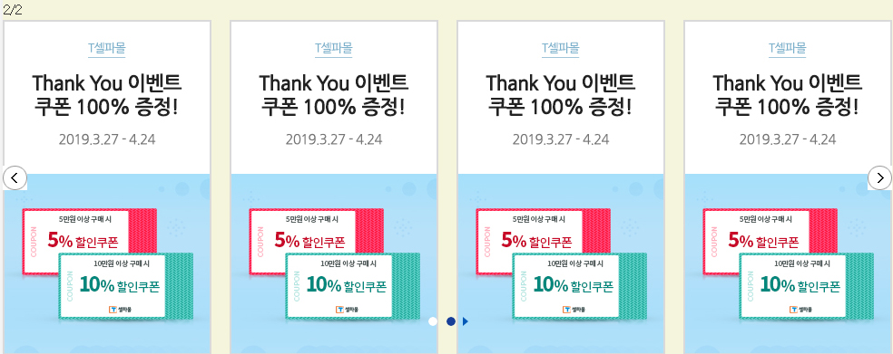

[ < 뒤로](https://netfolder.github.io/#sample)

### bxSlider option [모든 옵션보기 ↓](#option)

<br>


### type1[ (전체 소스보기) ](https://github.com/netfolder/public_chunjae/blob/master/bxSlider/html/bxslider_type1.html)

 	
	
	
	


#### Include
``` html
<link rel="stylesheet" href="http://edu.tsherpa.co.kr/Content/css/base.css">
<link rel="stylesheet" href="http://edu.tsherpa.co.kr/Content/css/common.css">
<link rel="stylesheet" href="http://edu.tsherpa.co.kr/Content/css/slick.css">
<script src="http://edu.tsherpa.co.kr/Scripts/jquery-1.12.4.min.js"></script>
<script src="http://edu.tsherpa.co.kr/Scripts/jquery.bxslider.js"></script>
```

#### css
``` css
#wrap {
	position: relative;
}
.bxslider_type1{position: relative; width: 743px;}		
.bxslider_type1 > .bx-wrapper{  }
.bxslider_type1 .bx-wrapper .bx-pager.bx-default-pager a:hover, .bxslider_type1 .bx-wrapper .bx-pager.bx-default-pager a.active, .bxslider_type1 .bx-wrapper .bx-pager.bx-default-pager a:focus {background:url(http://edu.design.tsherpa.co.kr/Content/image/main/ico_on.png) no-repeat center top;}
.bxslider_type1 .bx-wrapper .bx-pager.bx-default-pager a {background:url(http://edu.design.tsherpa.co.kr/Content/image/main/ico_off.png) no-repeat center top;text-indent: -9999px;display: block;width: 10px;height: 10px;margin: 0 5px;-moz-border-radius: 5px;-webkit-border-radius: 5px;border-radius: 5px;}
.bxslider_type1 .bx-wrapper .bx-controls-auto .bx-start {display: block;text-indent: -9999px;width: 6px;height: 10px;background: url(http://edu.design.tsherpa.co.kr/Content/image/main/ico_play.png) 0 0 no-repeat;margin: 0 3px;}
.bxslider_type1 .bx-wrapper .bx-controls-auto .bx-stop {display: block;text-indent: -9999px;width: 6px;height: 10px;background: url(http://edu.design.tsherpa.co.kr/Content/image/main/ico_stop.png) 0 0 no-repeat;margin: 0 3px;}
.bxslider_type1 .bx-wrapper .bx-controls{ position: absolute; bottom:0px; width:100%;text-align: center; z-index: 999}
.bxslider_type1 .bx-wrapper .bx-pager{ text-align: center; display: inline-block;}
.bxslider_type1 .bx-wrapper .bx-pager .bx-pager-item{ display: inline-block;}
.bxslider_type1 .bx-wrapper .bx-controls-auto{ display: inline-block;}
.btns{position: absolute; width: 27px; height: 27px; display: block; z-index: 100; top:50%; margin-top:-13px;}
.btn_pre{background:url(http://edu.tsherpa.co.kr/content/image/main/page_pre.gif) no-repeat;}
.btn_pre:hover{background:url(http://edu.tsherpa.co.kr/content/image/main/page_pre_off.gif) no-repeat;}
.btn_next{
	right: 0;
	background:url(http://edu.tsherpa.co.kr/content/image/main/page_next.gif) no-repeat;
}
.btn_next:hover{background:url(http://edu.tsherpa.co.kr/content/image/main/page_next_off.gif) no-repeat;}		
```

#### html
``` html
<div id="wrap">
	<!-- 복사 -->
	<div class="bxslider_type1 bx_slide_01">
		<a href="javascript:void(0);" class="btns btn_pre" title="이전"></a>
		<a href="javascript:void(0);" class="btns btn_next" title="다음"></a>
		<ul class="bxslider">
			<li></li>
			<li></li>
			<li></li>
			<li></li>
			<li></li>
			<li></li>
			<li></li>
		</ul>
	</div>
</div>
```

#### script
``` javascript	
$(document).ready(function() {
	function BxSlider($selector , option){
		var el = $selector;
		$(el+' .bxslider').bxSlider({
			auto: option.auto,
			autoControls: option.autoControls,
			mode: option.mode,
			speed: option.speed,
			pause: option.pause,						
			autoControls: option.autoControls,
			pager: option.pager,
			controls:option.controls,
			prevClass: el+' .btn_next',
			nextClass: el+' .btn_pre'
		});
	}
	var option_1 = {
		auto: true,
		autoControls: true,
		mode: 'fade',
		speed: 500,
		pause: 1000,						
		autoControls: true,
		pager: true,
		controls:false
	}
	var slider_01 = new BxSlider(".bx_slide_01" , option_1);
});
```

<br>


### type2[ (전체 소스보기) ](https://github.com/netfolder/public_chunjae/blob/master/bxSlider/html/bxslider_type2.html)

 	


#### Include
``` html
<link rel="stylesheet" href="http://edu.tsherpa.co.kr/Content/css/base.css">
<link rel="stylesheet" href="http://edu.tsherpa.co.kr/Content/css/common.css">
<link rel="stylesheet" href="http://edu.tsherpa.co.kr/Content/css/slick.css">
<script src="http://edu.tsherpa.co.kr/Scripts/jquery-1.12.4.min.js"></script>
<script src="http://edu.tsherpa.co.kr/Scripts/jquery.bxslider.js"></script>
```

#### css
``` css
#wrap {
	position: relative;
	background-color: beige
}
/* 복사 */
.bxslider_type2{position: relative; width: 980px;}		
.bxslider_type2 .bx-wrapper{ width: 980px; max-width:none; }
.bxslider_type2 .bx-wrapper .bx-pager.bx-default-pager a:hover, .bxslider_type2 .bx-wrapper .bx-pager.bx-default-pager a.active, .bxslider_type2 .bx-wrapper .bx-pager.bx-default-pager a:focus {background:url(http://edu.design.tsherpa.co.kr/Content/image/main/ico_on.png) no-repeat center top;}
.bxslider_type2 .bx-wrapper .bx-pager.bx-default-pager a {background:url(http://edu.design.tsherpa.co.kr/Content/image/main/ico_off.png) no-repeat center top;text-indent: -9999px;display: block;width: 10px;height: 10px;margin: 0 5px;-moz-border-radius: 5px;-webkit-border-radius: 5px;border-radius: 5px;}
.bxslider_type2 .bx-wrapper .bx-controls-auto .bx-start {display: block;text-indent: -9999px;width: 6px;height: 10px;background: url(http://edu.design.tsherpa.co.kr/Content/image/main/ico_play.png) 0 0 no-repeat;margin: 0 3px;}
.bxslider_type2 .bx-wrapper .bx-controls-auto .bx-stop {display: block;text-indent: -9999px;width: 6px;height: 10px;background: url(http://edu.design.tsherpa.co.kr/Content/image/main/ico_stop.png) 0 0 no-repeat;margin: 0 3px;}
.bxslider_type2 .bx-wrapper .bx-controls{ position: absolute; top:350px; width:100%;text-align: center;}
.bxslider_type2 .bx-wrapper .bx-pager{ text-align: center; display: inline-block;}
.bxslider_type2 .bx-wrapper .bx-pager .bx-pager-item{ display: inline-block;}
.bxslider_type2 .bx-wrapper .bx-controls-auto{ display: inline-block;}
.bxslider_type2 > ul > li {}
.btns{position: absolute; width: 27px; height: 27px; display: block; z-index: 100; top:50%; margin-top:-13px;}
.btn_pre{background:url(http://edu.tsherpa.co.kr/content/image/main/page_pre.gif) no-repeat;}
.btn_pre:hover{background:url(http://edu.tsherpa.co.kr/content/image/main/page_pre_off.gif) no-repeat;}
.btn_next{
	right: 0;
	background:url(http://edu.tsherpa.co.kr/content/image/main/page_next.gif) no-repeat;
}
.btn_next:hover{background:url(http://edu.tsherpa.co.kr/content/image/main/page_next_off.gif) no-repeat;}	
```

#### html
``` html
<div id="wrap">
	<div class="bxslider_type2">
		<span id="count">1/2</span>
		<a href="javascript:void(0);" class="btns btn_pre" title="이전"></a>
		<a href="javascript:void(0);" class="btns btn_next" title="다음"></a>
		<ul class="bxslider">
			<li></li>
			<li></li>
			<li></li>
			<li></li>

			<li></li>
			<li></li>
			<li></li>
			<li></li>
		</ul>
	</div>
</div>
```

#### script
``` javascript	
$(document).ready(function() {				
	var slidePerView = 4; //1페이지에 보이는 요소개수
	slider = $('.bxslider_type2 .bxslider').bxSlider({
		minSlides: 2,
		maxSlides: slidePerView,
		auto: true,
		autoControls: true,
		slideMargin: 20,
		speed: 500,
		pause: 3500,
		slideWidth:230,
		/*mode: 'fade',*/
		autoControls: true,
		pager: true,
		controls:false,
		prevClass: ".btn_next",
	    nextClass: ".btn_pre",
		onSlideAfter : function(){
			 //$('.slide-number').text((slider.getCurrentSlide()+1)+'/'+slider.getSlideCount());   
			//console.log((slider.getCurrentSlide()+1)+'/'+slider.getSlideCount()/4);
			$("#count").html((slider.getCurrentSlide()+1)+'/'+slider.getSlideCount()/slidePerView)
		}
	});
	$("#count").html(1+'/'+slider.getSlideCount()/slidePerView)
});
```


#### <a name='option'>option</a>
```javascript

/* 슬라이드의버튼 클래스 정의 : controls:false 설정 */
prevClass: ".btn_next",
nextClass: ".btn_pre",

/* 슬라이드 되고 난 후 제어시 */
onSlideAfter:function(){

}

/* 슬라이드 타입 설정 */
mode: 'horizontal',
// option : 'horizontal', 'vertical', 'fade'

/* 슬라이드 타입 설정 */
speed: 500,
// option : 정수

/* 슬라이드가 자동으로 전환됩니다. */
auto: false,
// option : true / false

/* 로드시 자동 표시가 시작됩니다. false이면 "시작"컨트롤을 클릭하면 슬라이드 쇼가 시작됩니다. */
autoStart: true,
// option : true / false

/* 마우스가 슬라이더 위로 움직이면 자동쇼가 멈춥니다. */
autoHover: false,
// option : true / false

/* 슬라이드가 전환 시간 */
pause: 4000,
// option : 정수

/* true이면 "다음"/ "이전"컨트롤이 추가됩니다. */
controls: true,
// option : true / false

/* true 이면 하단 pager 버튼이 추가 됩니다. */
pager: true,
// option : true / false

/* true 인 경우 마지막 슬라이에서 "다음"을 클릭하면 첫 번째 슬라이드로 전환 */
infiniteLoop: true,
// option : true / false

/* true이면 마지막 슬라이드에서 다음버튼을 숨긴다. 첫번째 슬라이드 일 경우 동일 */
hideControlOnEnd: false,
// option : true / false

/* 슬라이더 위로 마우스를 가져가면 슬러이더 일시 중지(css 전환을 사용하는 경우 기능이 작동하지 않음.) */
tickerHover: false,
// option : true / false

/* 슬라이더의 자동 크기 조절을 활성화 또는 비활성와 합니다.(반응형에서 사용) */
responsive: true,
// option : true / false

/* true 인 경우 슬라이더가 터치 스 와이프 전환을 허용합니다.(반응형에서 사용) */
touchEnabled: true,
// option : true / false

/* 슬라이드 전환을 실행하려면 터치 스 와이프가 초과해야하는 픽셀의 양입니다. 참고 : touchEnabled : true 인 경우에만 사용됩니다. */
swipeThreshold: 50,
// option : 정수

/* true이면 가로 및 세로 슬라이드 애니메이션에 CSS 전환이 사용됩니다 (기본 하드웨어 가속을 사용함). false이면 jQuery animate ()가 사용됩니다. */
useCSS: true,
// option : true / false

/* 최소 슬라이더 되는 갯수 (maxSlides와 같이 사용) */
minSlides: 1,
// option : 정수

/* 최대 슬라이더 되는 갯수 (minSlides와 같이 사용) */
maxSlides: 1,
// option : 정수

/* 각 슬라이더의 width값 설정 */
slideWidth: 0,
// option : 정수


```
