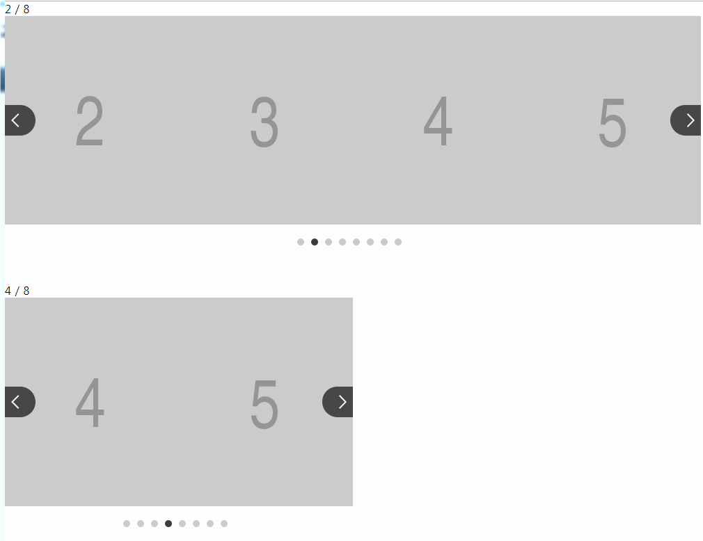
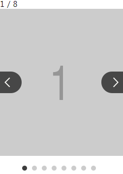

[ < 뒤로](https://netfolder.github.io/#sample)
<br>
#### slick


### type1[ (전체 소스보기) ](https://github.com/netfolder/netfolder.github.io/blob/master/slick/html/slick_type1.html)


 	


#### Include
``` html
<link rel="stylesheet" href="https://cdnjs.cloudflare.com/ajax/libs/slick-carousel/1.6.0/slick.css">
<script src="http://edu.tsherpa.co.kr/Scripts/jquery-1.12.4.min.js"></script>
<script src="https://cdnjs.cloudflare.com/ajax/libs/slick-carousel/1.6.0/slick.js"></script>
```

#### css
``` css
#wrap {position: relative; }
.slick_slide_01{width: 1000px;}
.slick_slide_02{width: 500px;}		
.slick_slide_03{width: 250px;}		
.slick_slide_04{width: 1000px;}	
.slick_type1 .slick-slide{}
.slick_type1 .slick-arrow{position: absolute; top:50%; margin-top:-22px;width: 45px; height: 44px; cursor: pointer;}
.slick_type1 .slick-arrow button{display: none !important;}
.slick_type1 .slick-prev.slick-arrow{left: 0px !important;  z-index: 10;font-size: 0; text-indent: -9999px; background: url(http://image.tsherpa.co.kr/middle/main/brd_arrow.png) no-repeat left top;}
.slick_type1 .slick-next.slick-arrow{right: 0px !important; font-size: 0; text-indent: -9999px; background: url(http://image.tsherpa.co.kr/middle/main/brd_arrow.png) no-repeat right top;}
.slick_type1 .slick-dots{position: absolute;bottom:-30px;display: block;width: 100%;padding: 0;margin: 0;list-style: none;text-align: center;}		
.slick_type1 .slick-dots li{width: 10px; height: 10px;padding: 0 5px;cursor: pointer;display: inline-block;background:url("http://image.tsherpa.co.kr/elementary/main/2019/btn_editng_dot_v2.png") no-repeat 0 0;}
.slick_type1 .slick-dots li.slick-active{background:url("http://image.tsherpa.co.kr/elementary/main/2019/btn_editng_dot_v2.png") no-repeat 0 -10px;}
.slick_type1 .slick-dots li button{display: none !important;}
.slick_type1 .slick-dots li button:focus{outline:none;}
```

#### html
``` html
<div id="wrap">
	<div class="slick_type1 slick_slide_01">
		<span id="count">0 / 0</span>
		<ul class="regular slider">   
			<li></li>
			<li></li>
			<li></li>
			<li></li>
			<li></li>
			<li></li>
			<li></li>
			<li></li>
		</ul>
	</div>	
	<div class="slick_type1 slick_slide_02">
		<span id="count">0 / 0</span>
		<ul class="regular slider">   
			<li></li>
			<li></li>
			<li></li>
			<li></li>
			<li></li>
			<li></li>
			<li></li>
			<li></li>
		</ul>
	</div>
</div>
```

#### script
``` javascript	
function SlickSlider($selector , option){
	var el = $selector;
	var slickColumnsTotal = $(el+" .regular li").length;
	var slickA = $(el+" .regular").slick({
		autoplay : option.autoplay,
		dots: option.dots,
		speed : option.speed /* 이미지가 슬라이딩시 걸리는 시간 */,
		arrows :option.arrows, /* 좌우 방향 버튼 */
		infinite: option.infinite,
		autoplaySpeed: option.autoplaySpeed /* 이미지가 다른 이미지로 넘어 갈때의 텀 */,
		arrows: option.arrows,
		slidesToShow: option.slidesToShow, /* 화면에 보이는계수 */
		slidesToScroll: option.slidesToScroll, /* 한번에 몇개씩 이동할지 */
		fade: option.fade
	});
	$(el+' .regular').on('beforeChange', function(event, slick, currentSlide, nextSlide){
		/*
			currentSlide : 현제 번호
			nextSlide : 다음 번호
		*/				
		$(el+" #count").html( (nextSlide+1)  + " / " + slickColumnsTotal)
	});
	$(el + " #count").html( 1 + " / " + slickColumnsTotal)
	/* 무한 롤링 모드가 아닐때 */
	if(!option.infinite){
		$(el+" .slick-prev").hide();
		$(el+' .regular').on('beforeChange', function(event, slick, currentSlide, nextSlide){
			if(nextSlide === 0){
				$(el+" .slick-prev").hide();
				$(el+" .slick-next").show();
			}else{
				$(el+" .slick-prev").show();
			}						
			if(nextSlide == (slickColumnsTotal - option.slidesToShow)){
			   console.log("last");
				$(el+" .slick-next").hide();
			}else{
				$(el+" .slick-next").show();
			}
		});					
	}			
}
/* 1번째 배너 */
var option_1 = {
	autoplay : false,
	dots: true,
	speed : 500,
	arrows :true,
	infinite: true,
	autoplaySpeed: 3000,
	arrows: true,
	slidesToShow: 4, /* 화면에 보이는계수 */
	slidesToScroll: 1, 
	fade: false
}
var slick_01 = new SlickSlider(".slick_slide_01" , option_1);
/* 1번째 배너 끝 */
/* 2번째 배너 */
var option_2 = {
	autoplay : false,
	dots: true,
	speed : 500,
	arrows :true,
	infinite: true,
	autoplaySpeed: 3000,
	arrows: true,
	slidesToShow: 2, /* 화면에 보이는계수 */
	slidesToScroll: 1, 
	fade: false
}
var slick_02 = new SlickSlider(".slick_slide_02" , option_2);
/* 2번째 배너 끝 */
```

<div style="text-align: right"> <a href="#top">⬆ back to top</a> </div>

	
	
	
<br>	

### type2[ (전체 소스보기) ](https://github.com/netfolder/netfolder.github.io/blob/master/slick/html/slick_type2.html)

 	


	
#### Include
``` html
<link rel="stylesheet" href="https://cdnjs.cloudflare.com/ajax/libs/slick-carousel/1.6.0/slick.css">
<script src="http://edu.tsherpa.co.kr/Scripts/jquery-1.12.4.min.js"></script>
<script src="https://cdnjs.cloudflare.com/ajax/libs/slick-carousel/1.6.0/slick.js"></script>
```

#### css
``` css
#wrap {position: relative; }
.slick_type1{width: 250px;}
.slick_type1 .slick-slide{}
.slick_type1 .slick-arrow{position: absolute; top:50%; margin-top:-22px;width: 45px; height: 44px; cursor: pointer;}
.slick_type1 .slick-arrow button{display: none !important;}
.slick_type1 .slick-prev.slick-arrow{left: 0px !important;  z-index: 10;font-size: 0; text-indent: -9999px; background: url(http://image.tsherpa.co.kr/middle/main/brd_arrow.png) no-repeat left top;}
.slick_type1 .slick-next.slick-arrow{right: 0px !important; font-size: 0; text-indent: -9999px; background: url(http://image.tsherpa.co.kr/middle/main/brd_arrow.png) no-repeat right top;}
.slick_type1 .slick-dots{position: absolute;bottom:-30px;display: block;width: 100%;padding: 0;margin: 0;list-style: none;text-align: center;}		
.slick_type1 .slick-dots li{width: 10px; height: 10px;padding: 0 5px;cursor: pointer;display: inline-block;background:url("http://image.tsherpa.co.kr/elementary/main/2019/btn_editng_dot_v2.png") no-repeat 0 0;}
.slick_type1 .slick-dots li.slick-active{background:url("http://image.tsherpa.co.kr/elementary/main/2019/btn_editng_dot_v2.png") no-repeat 0 -10px;}
.slick_type1 .slick-dots li button{display: none !important;}
.slick_type1 .slick-dots li button:focus{outline:none;}
```

#### html
``` html
<div id="wrap">
	<div class="slick_type1">
		<span id="count">0 / 0</span>
		<ul class="regular slider">   
			<li></li>
			<li></li>
			<li></li>
			<li></li>
			<li></li>
			<li></li>
			<li></li>
			<li></li>
		</ul>
	</div>
</div>
```

#### script
``` javascript	
var slickColumnsTotal = $('.slick_type1 .regular li').length;
var pagePerView = 1;/* 화면에 보이는계수 */
var slickA = $(".slick_type1 .regular").slick({
	autoplay : false,
	dots: true,
	speed : 500 /* 이미지가 슬라이딩시 걸리는 시간 */,
	arrows :true, /* 좌우 방향 버튼 */
	infinite: true,
	autoplaySpeed: 3000 /* 이미지가 다른 이미지로 넘어 갈때의 텀 */,
	arrows: true,
	slidesToShow: pagePerView, /* 화면에 보이는계수 */
	slidesToScroll: 1, /* 한번에 몇개씩 이동할지 */
	fade: false
});

$('.slick_type1 .regular').on('beforeChange', function(event, slick, currentSlide, nextSlide){
	/*
		currentSlide : 현제 번호
		nextSlide : 다음 번호
	*/				
	$("#count").html( (nextSlide+1)  + " / " + slickColumnsTotal)
});
$("#count").html( 1 + " / " + slickColumnsTotal)
/* 1번째 배너 끝 */
```

<div style="text-align: right"> <a href="#top">⬆ back to top</a> </div>
