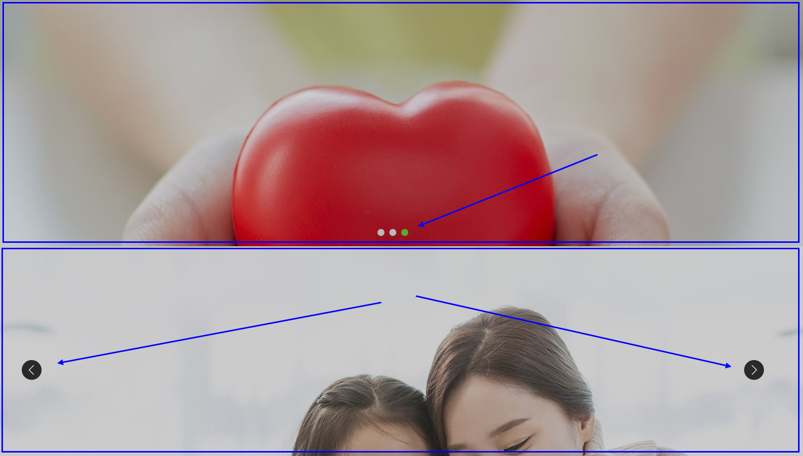
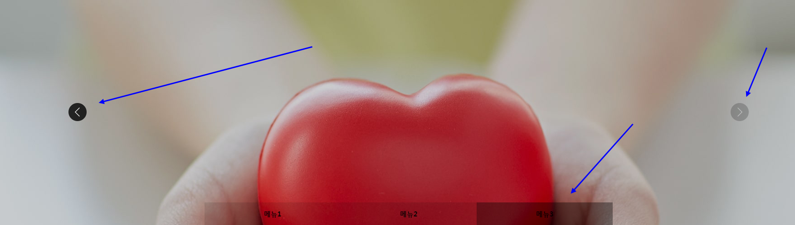

[ < 뒤로](https://netfolder.github.io/#sample)
<br>
#### swiper 3.x

#### [ (swiper 3.x api) ](https://github.com/nolimits4web/Swiper/blob/Swiper3/API.md)

### type1[ (기본 롤링) ](https://github.com/netfolder/netfolder.github.io/blob/master/swiper/html/m_swiper.html)

 	


#### html
``` html
<!DOCTYPE html>
<html lang="ko">
<head>
	<meta charset="utf-8">
	<title>swiper 3.2.7</title>
	<meta id="viewport" name="viewport" content="width=device-width,initial-scale=1, user-scalable=no" />
	<meta http-equiv="cleartype" content="on"/>
	<link rel="stylesheet" href="https://cdnjs.cloudflare.com/ajax/libs/Swiper/3.2.7/css/swiper.css">
	<style type="text/css">
		*{margin:0;padding:0}
		img{border:0;vertical-align:top}
		li{list-style:none}
		#p_header{margin:0 auto;position:relative; width: 500px;}
		#p_header img{width:100%}
		#p_header .slider_wrap{position:relative;overflow:hidden;background:#fff;padding-bottom:10%}
		#p_header .swiper-container {overflow:hidden;position:relative}
		#p_header .swiper-wrapper {width:100%;height:100%}
		#p_header .swiper-slide {overflow:hidden;position:relative}
		#p_header .swiper-pagination{width:100%;text-align:center;position:absolute;left:0;bottom:5%}
		#p_header .swiper-pagination-bullet{width:6px;height:6px;margin:0 5px;background:#000;border:2px #000 solid;border-radius:100%;opacity:1}
		#p_header .swiper-pagination-bullet-active{border:2px #000 solid;opacity:1;background:transparent}
		#p_header .swiper-button-prev{opacity:0.3;width:40px;height:40px;z-index:10;top:50%;background-color:#fff;background-size:30px 20px;margin-top:-20px;left:0}
		#p_header .swiper-button-next{opacity:0.3;width:40px;height:40px;z-index:10;top:50%;background-color:#fff;background-size:30px 20px;margin-top:-20px;right:0}
	</style>
	<script type="text/javascript" src="https://cdnjs.cloudflare.com/ajax/libs/jquery/1.12.4/jquery.min.js"></script>
	<script src="https://cdnjs.cloudflare.com/ajax/libs/Swiper/3.2.7/js/swiper.min.js"></script>
</head>
<body>
	<div id="p_header">
		<div class="slider_wrap">
			<div class="swiper-container">
				<div class="swiper-wrapper">
					<!--  -->
					<div class="swiper-slide"></div>
					<div class="swiper-slide"></div>
					<div class="swiper-slide"></div>
					<div class="swiper-slide"></div>
					<div class="swiper-slide"></div>
					<!-- // -->
				</div>
			</div>
			<!-- Add Arrows -->
			<div class="swiper-button-next swiper-button-black"></div>
			<div class="swiper-button-prev swiper-button-black"></div>
			<div class="swiper-pagination"></div>
		</div>
		<script>
			function getSlideDataIndex(swipe){
				var activeIndex = swipe.activeIndex;
				var slidesLen = swipe.slides.length;
				if(swipe.params.loop){
					switch(swipe.activeIndex){
						case 0:
							activeIndex = slidesLen-3;
							break;
						case slidesLen-1:
							activeIndex = 0;
							break;
						default:
							--activeIndex;
					}
				}
				return  activeIndex;
			}
			var swiper01 = new Swiper('#p_header .slider_wrap .swiper-container', {
				autoplay : 2000,
				nextButton: '#p_header .slider_wrap .swiper-button-next',
				prevButton: '#p_header .slider_wrap .swiper-button-prev',
				pagination: '#p_header .swiper-pagination',
				paginationClickable: true,
				loop: true,
				autoHeight: true,
				spaceBetween: 0,
				onSlideChangeEnd : function(event){
              		var num = getSlideDataIndex(event)
					console.log(num);
				}
			});
		</script>
	</div>
</body>
</html>
```


<div style="text-align: right"> <a href="#top">⬆ back to top</a> </div>
<br>


### type2[ (모바일 텝 활성화) ](https://github.com/netfolder/netfolder.github.io/blob/master/swiper/html/m_swiper_01.html)

#### [ (미리보기) ](http://pagelab.coding1.chunjae.co.kr/event/event_190813.html)

 	


#### html
``` html
<!DOCTYPE html>
<html lang="ko">
<head>
	<meta charset="utf-8">
	<meta id="viewport" name="viewport" content="width=device-width,initial-scale=1, user-scalable=no" />
	<meta http-equiv="cleartype" content="on"/>
	<link rel="stylesheet" href="https://cdnjs.cloudflare.com/ajax/libs/Swiper/3.2.7/css/swiper.css">
	<title>Page lab | 랜딩페이지</title>
	<style type="text/css">
		img{border:0;vertical-align:top}
		li{list-style:none}
		#p_header{position: relative; height: 56px;}
		#bottom_area{position: relative; height: 80px; text-align: center}
		#p_header .pc_btn{position: absolute; right:0; height:100%; }
		#p_header img{height: 100%;}
		#bottom_area img{height: 100%;}
		#p_content{margin:0 auto;position:relative; width: 100%;}
		#p_content img{width:100%}
		#p_content .slider_wrap{position:relative;overflow:hidden;background:#fff;}
		#p_content .swiper-container {overflow:hidden;position:relative}
		#p_content .swiper-wrapper {width:100%;height:100%}
		#p_content .swiper-slide {overflow:hidden;position:relative}
		#p_content .swiper-pagination{width:100%;text-align:center;position:absolute;left:0;bottom:5%; display: none;}
		#p_content .swiper-pagination-bullet{width:6px;height:6px;margin:0 5px;background:#000;border:2px #000 solid;border-radius:100%;opacity:1}
		#p_content .swiper-pagination-bullet-active{border:2px #000 solid;opacity:1;background:transparent}
		#p_content .swiper-button-prev{opacity:0.3;width:40px;height:40px;z-index:10;top:50%;background-color:#fff;background-size:30px 20px;margin-top:-20px;left:0}
		#p_content .swiper-button-next{opacity:0.3;width:40px;height:40px;z-index:10;top:50%;background-color:#fff;background-size:30px 20px;margin-top:-20px;right:0}
		.container{position: relative; /*max-width:720px;*/ margin:0 auto;}
		.swiper-container {
			width: 100%;
		}
		.swiper-wrapper .swiper-slide img{width:100%;}
		.swiper-button-next , .swiper-button-prev{display: none;}
		.slider_tab{width:100%; height:20%; position: absolute; top:0; z-index: 50; box-sizing: border-box; padding-left:4%; }
		.slider_tab .sbtns{position: relative;display: inline-block;width: 23%;height:66%;z-index: 500;margin-right: 0.5%;top: 23%;}
		.img_obj{position: absolute; left: 0; top:0; width:100%;}
	</style>
	<script type="text/javascript" src="https://cdnjs.cloudflare.com/ajax/libs/jquery/1.12.4/jquery.min.js"></script>
	<script src="https://cdnjs.cloudflare.com/ajax/libs/Swiper/3.2.7/js/swiper.min.js"></script>
</head>
<body>
	<div id="p_header">
		
		<a class="pc_btn" href="https://www.pageshop.co.kr"></a>
	</div>
	<div id="p_content">
		<div class="container">
			<div class="slider_wrap">
				<div class="slider_tab">
					<a class="sbtns" href="javascript:;"></a>
					<a class="sbtns" href="javascript:;"></a>
					<a class="sbtns" href="javascript:;"></a>
					<a class="sbtns" href="javascript:;"></a>
					
				</div>
				<div class="swiper-container">
					<div class="swiper-wrapper">
						<!--  -->
						<div class="swiper-slide"></div>
						<div class="swiper-slide"></div>
						<div class="swiper-slide"></div>
						<div class="swiper-slide"></div>
						<!-- // -->
					</div>
				</div>
				<!-- Add Arrows -->
				<div class="swiper-button-next swiper-button-black"></div>
				<div class="swiper-button-prev swiper-button-black"></div>
				<div class="swiper-pagination"></div>
			</div>
		</div>
		<script>
			function getSlideDataIndex(swipe){
				var activeIndex = swipe.activeIndex;
				var slidesLen = swipe.slides.length;
				if(swipe.params.loop){
					switch(swipe.activeIndex){
						case 0:
							activeIndex = slidesLen-3;
							break;
						case slidesLen-1:
							activeIndex = 0;
							break;
						default:
							--activeIndex;
					}
				}
				return  activeIndex;
			}
			$(".sbtns").each(function(index){
				var $this = $(this)
				$this.click(function(){
					//console.log("click : ", index)
					s_swiper.slideTo(index+1)
					selectTab(index)
				})
			})
			var s_swiper = new Swiper('#p_content .slider_wrap .swiper-container', {
				autoplay : 4500,
				nextButton: '#p_content .slider_wrap .swiper-button-next',
				prevButton: '#p_content .slider_wrap .swiper-button-prev',
				pagination: '.swiper-pagination',
				paginationClickable: false,
				loop: true,
				autoHeight: true,
				spaceBetween: 0,
				onSlideChangeEnd : function(event){
					var num = getSlideDataIndex(event)
					selectTab(num)
					event.startAutoplay();
				}
			})
			function selectTab(n){
				//console.log("selectTab  : ", n );
				//
				$(".img_obj").attr("src" , "/images/event/20190813/slide_tab_0"+ n +".png")
			}
		</script>
	</div>
	<div id="bottom_area">
		
	</div>
</body>
</html>
```

<div style="text-align: right"> <a href="#top">⬆ back to top</a> </div>
<br>


### type3[ (가로100%) ](https://github.com/netfolder/netfolder.github.io/blob/master/swiper/html/w_rolling.html)

#### [ (미리보기) ](https://netfolder.github.io/swiper/html/w_rolling.html)

 	


#### html
``` html
<!DOCTYPE html>
<html lang="ko">
<head>
	<meta charset="utf-8">
	<title>swiper 3.2.7 100% 롤링</title>
	<meta id="viewport" name="viewport" content="width=device-width,initial-scale=1, user-scalable=no" />
	<meta http-equiv="cleartype" content="on"/>
	<link rel="stylesheet" href="https://cdnjs.cloudflare.com/ajax/libs/Swiper/3.2.7/css/swiper.css">
	<style type="text/css">
		/* 반영시 해당코드는 복붙 안해도됨  */
		*{padding:0;margin: 0;}
		/* //반영시 해당코드는 복붙 안해도됨  */

		/* 대체 텍스트가 아닌 접근성을 위한 숨김 텍스트를 제공할 때 */
		.ir_su {overflow: hidden; position:absolute; width:0; height:0; line-height:0; text-indent:-9999px;}

		.visual{margin:0 padding:0; position:relative; width:100%;}		
		.visual img{width:100%; border:0; vertical-align: top;}
		.visual .slider_wrap{position:relative; width: 100%;  margin: 0 auto; overflow:hidden;background:#fff;}
		.visual .swiper-container {overflow:hidden;position:relative}
		.visual .swiper-wrapper {width:100%;height:100%; }
		.visual .swiper-slide {overflow:hidden;position:relative;height:500px;background-repeat: no-repeat; background-position: center top;}
		.visual .swiper-pagination{width:100%;text-align:center;position:absolute;left:0;bottom:17px; display: block}
		.visual .swiper-pagination-bullet{width:14px;height:14px;margin:0 5px;background:#b0bcbd;border-radius:100%;opacity:1}
		.visual .swiper-pagination-bullet-active{opacity:1;background:#57ad30}
		.visual .swiper-button-prev{opacity:0;width:40px;height:40px;border-radius: 50%; z-index:10;top:50%;background-color:#000;background-size:30px 20px;margin-top:-20px;left:0; left:50%; margin-left:-750px; }		
		.visual .swiper-button-next{opacity:0;width:40px;height:40px;border-radius: 50%;  z-index:10;top:50%;background-color:#000;background-size:30px 20px;margin-top:-20px;right:50%; margin-right:-750px;}		
		

		/* 컨텐츠 코드 */
		.con01{margin:0 padding:0; position:relative; width:100%;}		
		.con01 img{width:100%; border:0; vertical-align: top;}
		.con01 .slider_wrap{position:relative; width: 100%;  margin: 0 auto; overflow:hidden;background:#fff;}
		.con01 .swiper-container {overflow:hidden;position:relative}
		.con01 .swiper-wrapper {width:100%;height:100%; }
		.con01 .swiper-slide {overflow:hidden;position:relative;height:500px;background-repeat: no-repeat; background-position: center top;}
		.con01 .swiper-pagination{width:100%;text-align:center;position:absolute;left:0;bottom:5%; display: none}
		.con01 .swiper-pagination-bullet{width:6px;height:6px;margin:0 5px;background:#000;border:2px #000 solid;border-radius:100%;opacity:1}
		.con01 .swiper-pagination-bullet-active{border:2px #000 solid;opacity:1;background:transparent}
		.con01 .swiper-button-prev{opacity:0.8;width:40px;height:40px;border-radius: 50%; z-index:10;top:50%;background-color:#000;background-size:30px 20px;margin-top:-20px;left:0; left:50%; margin-left:-750px; transition: all 0.45s ease;}
		.con01 .swiper-button-prev:hover{opacity:0.3;}
		.con01 .swiper-button-next{opacity:0.8;width:40px;height:40px;border-radius: 50%;  z-index:10;top:50%;background-color:#000;background-size:30px 20px;margin-top:-20px;right:50%; margin-right:-750px;transition: all 0.45s ease;}
		.con01 .swiper-button-next:hover{opacity:0.3;}
		/* 컨텐츠 버튼 좌표값 */
		.con01 .con_btn{position: absolute;left: 50%;width: 229px;height: 43px;}		
		.con01 .bt01{margin-left: -640px;top: 421px;} 
		.con01 .bt02{margin-left: -641px;top: 425px;}
		.con01 .bt03{margin-left: -640px;top: 446px;}
	</style>
	<script type="text/javascript" src="https://cdnjs.cloudflare.com/ajax/libs/jquery/1.12.4/jquery.min.js"></script>
	<script src="https://cdnjs.cloudflare.com/ajax/libs/Swiper/3.2.7/js/swiper.min.js"></script>
</head>
<body>
	<div class="visual">
		<div class="slider_wrap">
			<div class="swiper-container">
				<div class="swiper-wrapper">
					<!--  -->
					<div class="swiper-slide" style="background-image:url(../images/vis_01.jpg);">
						
							<span class="ir_su">
								LED 바닥형 보행신호등

								LED 바닥형 보행신호등은
								신호등과 연동한 LED 바닥형 보행신 호등이 추가됨으로서,
								정확한 신호역할 및 보행자로 하여금 심리적 저지선으로 느끼게 하여,
								무단횡단을 사전에 방지하는 등 보행자를 위한 
								새로운 개념의 횡단보도 안전시설물입니다.
							</span>
							
						
					</div>
					<div class="swiper-slide" style="background-image:url(../images/vis_02.jpg);">
						<span class="ir_su">
							단열재

							국내·외 유수의 제조원들과 계약을 통해 복잡 다단한 유통경로를 단일화시키고, 
							체계적인 유통 시스템 및 영업망을 구축하여 제조사(Manufacturer)에게는 
							판로 확장과 함께 생산 및 연구 개발에만 전념 할 수 있는 제조 환경을, 
							최종 소비자(End user) 에게는 좋은 상품을 합리적인 비용으로 구매 할 수 있는 
							구매 환경을 제공하고 있습니다.
						</span>
						
					</div>
					<div class="swiper-slide" style="background-image:url(../images/vis_03.jpg);">
						<span class="ir_su">
							공기정화기

							LED 바닥형 보행신호등은
							신호등과 연동한 LED 바닥형 보행신 호등이 추가됨으로서,
							정확한 신호역할 및 보행자로 하여금 심리적 저지선으로 느끼게 하여,
							무단횡단을 사전에 방지하는 등 보행자를 위한 
							새로운 개념의 횡단보도 안전시설물입니다.
						</span>
						
					</div>
					
					
					<!-- // -->
				</div>
			</div>
			<!-- Add Arrows -->
			
			<div class="swiper-pagination"></div>
		</div>
		<div class="swiper-button-next swiper-button-white"></div>
		<div class="swiper-button-prev swiper-button-white"></div>
		<script>
			
			var swiper01 = new Swiper('.visual .slider_wrap .swiper-container', {
				autoplay : 4500, // 4.5초마다 롤링 , 롤링 안할시 false 값 
				nextButton: '.visual .swiper-button-next',
				prevButton: '.visual .swiper-button-prev',
				pagination: '.visual .swiper-pagination',
				paginationClickable: true,
				loop: true,
				autoHeight: true,
				spaceBetween: 0
			});
		</script>
	</div>


	<div class="con01">
		<div class="slider_wrap">
			<div class="swiper-container">
				<div class="swiper-wrapper">
					<!--  -->
					<div class="swiper-slide" style="background-image:url(../images/vis_01.jpg);">
						
							<span class="ir_su">
								LED 바닥형 보행신호등

								LED 바닥형 보행신호등은
								신호등과 연동한 LED 바닥형 보행신 호등이 추가됨으로서,
								정확한 신호역할 및 보행자로 하여금 심리적 저지선으로 느끼게 하여,
								무단횡단을 사전에 방지하는 등 보행자를 위한 
								새로운 개념의 횡단보도 안전시설물입니다.
							</span>
							<a class="con_btn bt01" href="http://www.naver.com" target="_blank"><span class="ir_su">VIEW MORE</span></a>
						
					</div>
					<div class="swiper-slide" style="background-image:url(../images/vis_02.jpg);">
						<span class="ir_su">
							단열재

							국내·외 유수의 제조원들과 계약을 통해 복잡 다단한 유통경로를 단일화시키고, 
							체계적인 유통 시스템 및 영업망을 구축하여 제조사(Manufacturer)에게는 
							판로 확장과 함께 생산 및 연구 개발에만 전념 할 수 있는 제조 환경을, 
							최종 소비자(End user) 에게는 좋은 상품을 합리적인 비용으로 구매 할 수 있는 
							구매 환경을 제공하고 있습니다.
						</span>
						<a class="con_btn bt02" href="http://www.daum.net" target="_blank"><span class="ir_su">VIEW MORE</span></a>
					</div>
					<div class="swiper-slide" style="background-image:url(../images/vis_03.jpg);">
						<span class="ir_su">
							공기정화기

							LED 바닥형 보행신호등은
							신호등과 연동한 LED 바닥형 보행신 호등이 추가됨으로서,
							정확한 신호역할 및 보행자로 하여금 심리적 저지선으로 느끼게 하여,
							무단횡단을 사전에 방지하는 등 보행자를 위한 
							새로운 개념의 횡단보도 안전시설물입니다.
						</span>
						<a class="con_btn bt03" href="http://www.google.com" target="_blank"><span class="ir_su">VIEW MORE</span></a>
					</div>
					
					
					<!-- // -->
				</div>
			</div>
			<!-- Add Arrows -->
			
			<div class="swiper-pagination"></div>
		</div>
		<div class="swiper-button-next swiper-button-white"></div>
		<div class="swiper-button-prev swiper-button-white"></div>
		<script>
			
			var swiper01 = new Swiper('.con01 .slider_wrap .swiper-container', {
				autoplay : false, // 4.5초마다 롤링 , 롤링 안할시 false 값 
				nextButton: '.con01 .swiper-button-next',
				prevButton: '.con01 .swiper-button-prev',
				pagination: '.con01 .swiper-pagination',
				paginationClickable: true,
				loop: true,
				autoHeight: true,
				spaceBetween: 0
			});
		</script>
	</div>
</body>
</html>
```

<div style="text-align: right"> <a href="#top">⬆ back to top</a> </div>
<br>


### type3[ (가로100% 텝메뉴 연계) ](https://github.com/netfolder/netfolder.github.io/blob/master/swiper/html/w_rolling_01.html)

#### [ (미리보기) ](https://netfolder.github.io/swiper/html/w_rolling_01.html)

 	


#### html
``` html
<!DOCTYPE html>
<html lang="ko">
<head>
	<meta charset="utf-8">
	<title>swiper 3.2.7</title>
	<meta id="viewport" name="viewport" content="width=device-width,initial-scale=1, user-scalable=no" />
	<meta http-equiv="cleartype" content="on"/>
	<link rel="stylesheet" href="https://cdnjs.cloudflare.com/ajax/libs/Swiper/3.2.7/css/swiper.css">
	<style type="text/css">
		/* 반영시 해당코드는 복붙 안해도됨  */
		*{padding:0;margin: 0;}
		/* //반영시 해당코드는 복붙 안해도됨  */

		/* 대체 텍스트가 아닌 접근성을 위한 숨김 텍스트를 제공할 때 */
		.ir_su {overflow: hidden; position:absolute; width:0; height:0; line-height:0; text-indent:-9999px;}
		.inner{width:900px; margin: 0 auto;}	
	
		/* 컨텐츠 코드 */
		.con01{margin:0 padding:0; position:relative; width:100%;}		
		.con01 img{width:100%; border:0; vertical-align: top;}
		.con01 .slider_wrap{position:relative; width: 100%;  margin: 0 auto; overflow:hidden;background:#fff;}
		.con01 .swiper-container {overflow:hidden;position:relative}
		.con01 .swiper-wrapper {width:100%;height:100%; }
		.con01 .swiper-slide {overflow:hidden;position:relative;height:500px;background-repeat: no-repeat; background-position: center top;}
		.con01 .swiper-pagination{width:100%;text-align:center;position:absolute;left:0;bottom:5%; display: none}
		.con01 .swiper-pagination-bullet{width:6px;height:6px;margin:0 5px;background:#000;border:2px #000 solid;border-radius:100%;opacity:1}
		.con01 .swiper-pagination-bullet-active{border:2px #000 solid;opacity:1;background:transparent}
		.con01 .swiper-button-prev{opacity:0.8;width:40px;height:40px;border-radius: 50%; z-index:10;top:50%;background-color:#000;background-size:30px 20px;margin-top:-20px;left:0; left:50%; margin-left:-750px; transition: all 0.45s ease;}
		.con01 .swiper-button-prev:hover{opacity:0.3;}
		.con01 .swiper-button-next{opacity:0.8;width:40px;height:40px;border-radius: 50%;  z-index:10;top:50%;background-color:#000;background-size:30px 20px;margin-top:-20px;right:50%; margin-right:-750px;transition: all 0.45s ease;}
		.con01 .swiper-button-next:hover{opacity:0.3;}
		.con01 .swiper-button-next.swiper-button-disabled{opacity:0.2;}
		.con01 .swiper-button-prev.swiper-button-disabled{opacity:0.2;}
		
		
		.menu{overflow:hidden; position: absolute; z-index: 100; bottom:0;}
		.menu li{list-style:none;float: left; box-sizing: border-box; text-align: center; background: rgba(0,0,0,0.1);}
		.menu li.on a{background: rgba(0,0,0,0.3);}
		.menu li a{display: block; width:300px; height:50px; line-height: 50px; font-size: 15px; text-decoration: none; color:#000; font-weight: bold;}


	</style>
	<script type="text/javascript" src="https://cdnjs.cloudflare.com/ajax/libs/jquery/1.12.4/jquery.min.js"></script>
	<script src="https://cdnjs.cloudflare.com/ajax/libs/Swiper/3.2.7/js/swiper.min.js"></script>
</head>
<body>
	
	<div class="con01">
		<div class="slider_wrap">
			<div class="inner">
				<ul class="menu">
					<li><a href="javascript:;">메뉴1</a></li>
					<li><a href="javascript:;">메뉴2</a></li>
					<li><a href="javascript:;">메뉴3</a></li>
				</ul>
			</div>
			

			<div class="swiper-container">
				<div class="swiper-wrapper">
					<!--  -->
					<div class="swiper-slide" style="background-image:url(../images/vis_01.jpg);">
						
							<span class="ir_su">
								LED 바닥형 보행신호등

								LED 바닥형 보행신호등은
								신호등과 연동한 LED 바닥형 보행신 호등이 추가됨으로서,
								정확한 신호역할 및 보행자로 하여금 심리적 저지선으로 느끼게 하여,
								무단횡단을 사전에 방지하는 등 보행자를 위한 
								새로운 개념의 횡단보도 안전시설물입니다.
							</span>
							<a class="con_btn bt01" href="http://www.naver.com" target="_blank"><span class="ir_su">VIEW MORE</span></a>
						
					</div>
					<div class="swiper-slide" style="background-image:url(../images/vis_02.jpg);">
						<span class="ir_su">
							단열재

							국내·외 유수의 제조원들과 계약을 통해 복잡 다단한 유통경로를 단일화시키고, 
							체계적인 유통 시스템 및 영업망을 구축하여 제조사(Manufacturer)에게는 
							판로 확장과 함께 생산 및 연구 개발에만 전념 할 수 있는 제조 환경을, 
							최종 소비자(End user) 에게는 좋은 상품을 합리적인 비용으로 구매 할 수 있는 
							구매 환경을 제공하고 있습니다.
						</span>
						<a class="con_btn bt02" href="http://www.daum.net" target="_blank"><span class="ir_su">VIEW MORE</span></a>
					</div>
					<div class="swiper-slide" style="background-image:url(../images/vis_03.jpg);">
						<span class="ir_su">
							공기정화기

							LED 바닥형 보행신호등은
							신호등과 연동한 LED 바닥형 보행신 호등이 추가됨으로서,
							정확한 신호역할 및 보행자로 하여금 심리적 저지선으로 느끼게 하여,
							무단횡단을 사전에 방지하는 등 보행자를 위한 
							새로운 개념의 횡단보도 안전시설물입니다.
						</span>
						<a class="con_btn bt03" href="http://www.google.com" target="_blank"><span class="ir_su">VIEW MORE</span></a>
					</div>
					
					
					<!-- // -->
				</div>
			</div>
			<!-- Add Arrows -->
			
			<div class="swiper-pagination"></div>
		</div>
		<div class="swiper-button-next swiper-button-white"></div>
		<div class="swiper-button-prev swiper-button-white"></div>
		<script>

			function getSlideDataIndex(swipe){
				var activeIndex = swipe.activeIndex;
				var slidesLen = swipe.slides.length;
				if(swipe.params.loop){
					switch(swipe.activeIndex){
						case 0:
							activeIndex = slidesLen-3;
							break;
						case slidesLen-1:
							activeIndex = 0;
							break;
						default:
							--activeIndex;
					}
				}
				return  activeIndex;
			}
			var swiper01 = new Swiper('.con01 .slider_wrap .swiper-container', {
				autoplay : 2000, // 4.5초마다 롤링 , 롤링 안할시 false 값 
				nextButton: '.con01 .swiper-button-next',
				prevButton: '.con01 .swiper-button-prev',
				pagination: '.con01 .swiper-pagination',
				paginationClickable: true,
				loop: false,
				autoHeight: true,
				spaceBetween: 0,
				onSlideChangeEnd : function(event){
              		var num = getSlideDataIndex(event)
					selectMenu(num)

					console.log(num)
				}
			});

			function selectMenu(n){
				$(".menu li").eq(n).addClass("on").siblings().removeClass('on')
				
			}


			$(".menu li>a").each(function(index){
				var $this = $(this)
				$this.click(function(){
					selectMenu(index)
					swiper01.slideTo(index)
				})
			});


		</script>
	</div>
</body>
</html>
```

<div style="text-align: right"> <a href="#top">⬆ back to top</a> </div>
<br>